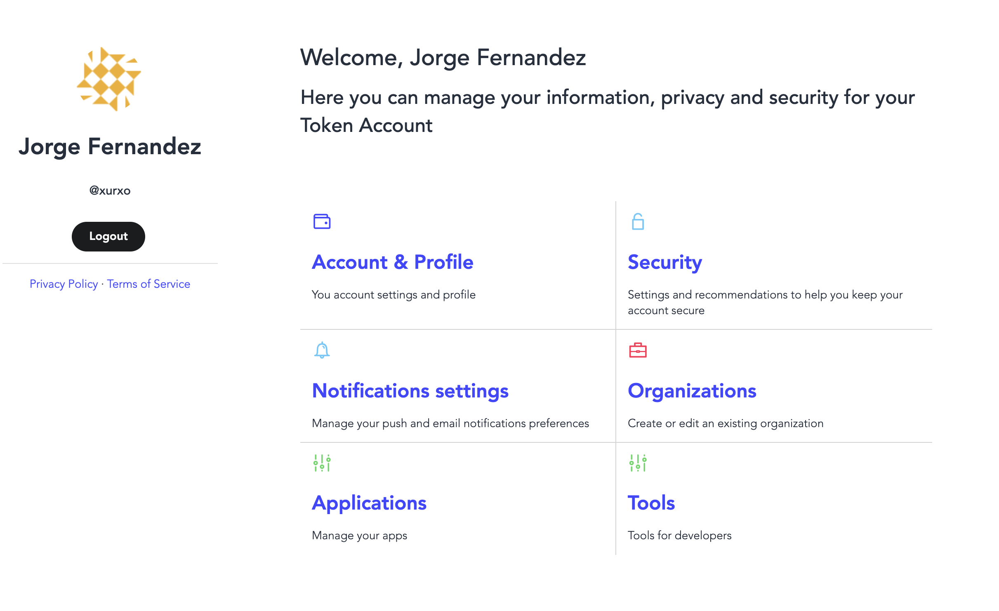

# Developer apps

Accessing the APIs requires a set of credentials that you must pass with each request. 

You will be generating these keys and tokens that you pass along with your API requests with a developer App. Each App will be able to generate its own App ID and secret key that you will use to make requests on behalf of the App.

In addition to generating the keys and tokens necessary to make API requests, you will also be able to provision the service your App plans to use and modify other settings related to your App.

#### Dashboard

You can access the dashboard to manage the Apps associated with your account. The dashboard allows developers to quickly and easily perform the following tasks:

* View your existing Apps and their associated credentials.
* Create new Organizations and Apps.
* Delete an unused Organization or App. 
* Review or update a specific App's settings, including updating name, desciption, website and provisioned services.
* Regenerate App specific credentials like App ID & Secret.

### Next Steps

* [Create developer account](https://developers.token-project.eu).
* Learn more about the [developer portal](developer-portal.md).
* Learn more about [authentication](auth.md).

