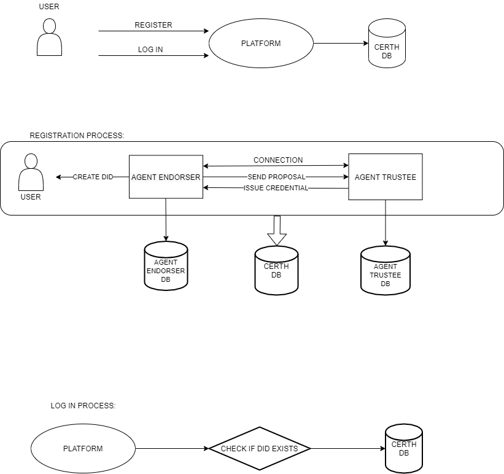
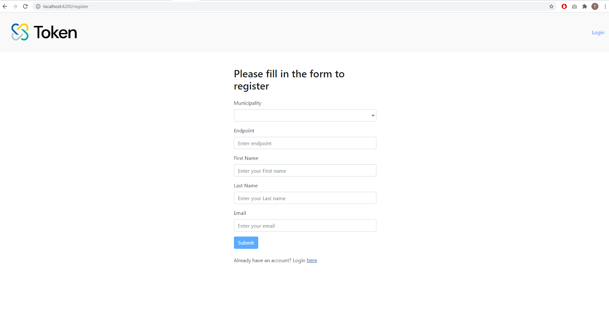
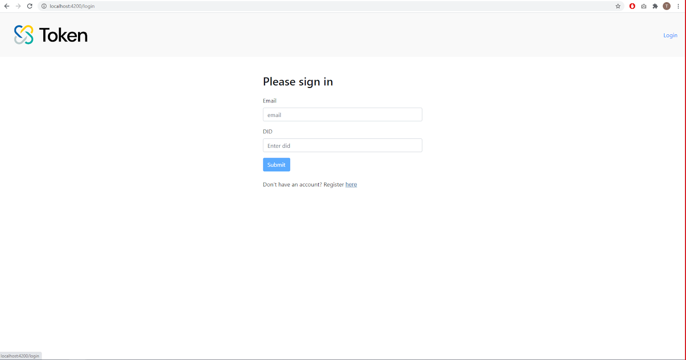

# Architecture

According to the above UML, the user can either register or log in to any platform that utilizes CERTH SSI as a Service solution. Following you can find a detailed guide for the necessary steps. 

**Registration:**

When a user registers, the Endorser Agent creates a DID and makes a connection with the Trustee Agent. When the connection is established, the Endorser Agent sends a proposal to the Trustee Agent in order to issue an ID Verifiable Credential. Then, the Trustee Agent issues an ID credential to the Endorser Agent. Now the user has a DID and an ID Credential in her/his/its wallet. 

When the registration is completed, the user will be directed to a page that shows their DID. The user must keep somewhere safe this DID as a digital or hard copy, because it is their globally unique identifier and it is required in order to log in and communicate with any other service.

**Log in:**

The user, after registers successfully, can log in to the platform with the DID that was created from the registration process. The above transactions of the agents are held in corresponding PostgreSQL databases, one for each agent. They are also stored along with other important metadata information of the user in a MySQL database.

