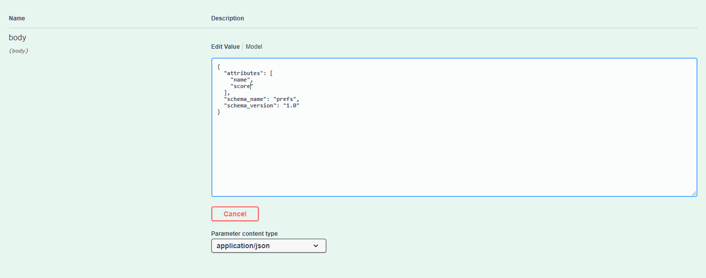

# Endpoints

## Create a local did for the wallet \(User\)

POST: /wallet/did/create \(Create a local DID\)

**Parameters:** No parameters

**Response**


## Create a new connection invitation \(Municipality\)

POST: /connections/create-invitation \(Create a new connection invitation\)

Parameters


Response


## Send a schema to the ledger

POST: /schemas \(Sends a schema to the ledger\)

Parameters



Response


## Send a credential definition to the ledger

POST: /credential-definitions \(Sends a credential definition to the ledger\)

Parameters


Response


## Receive a new connection invitation\(User\)

POST: /connections/receive-invitation \(Receive a new connection invitation\)

Parameters


Response


## Send Issuer a credential proposal

POST: /issue-credential/send-proposal \(Send issuer a credential proposal\)

Parameters


Response


**Did example**

```text
{
    "result": {
    "did": "YVJfCH2gPuK3H1qTrZdm8t",
    "verkey": "JAQ5tQnaEoroWesuvmbD4euji6pC6dq8vbw29RTSs45P",
    "posture": "wallet_only" }
}
```

**Schema example**

```text
{
    "schema_id": "V4SGRU86Z58d6TV7PBUe6f:2:identification:1.0",
    "schema": {
        "ver": "1.0",
        “id”: "V4SGRU86Z58d6TV7PBUe6f:2:identification:1.0",
        “name": "identification”,
        “version": "1.0”,
        “attrNames”: [
        “name”,
        “surname”,
        “fathersname”,
        “mothersname”,
        “motherssurname”,
        “dateofbirth”,
        “placeofbirth”,
        “registeredcitizen”
    ],
    "seqNo": 9
    }
}
```

