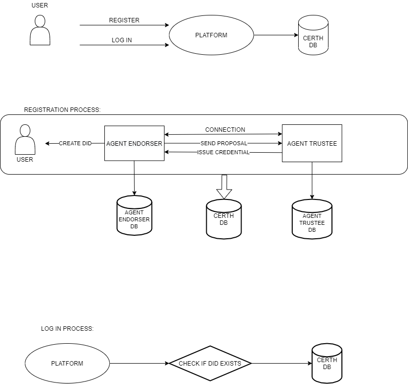
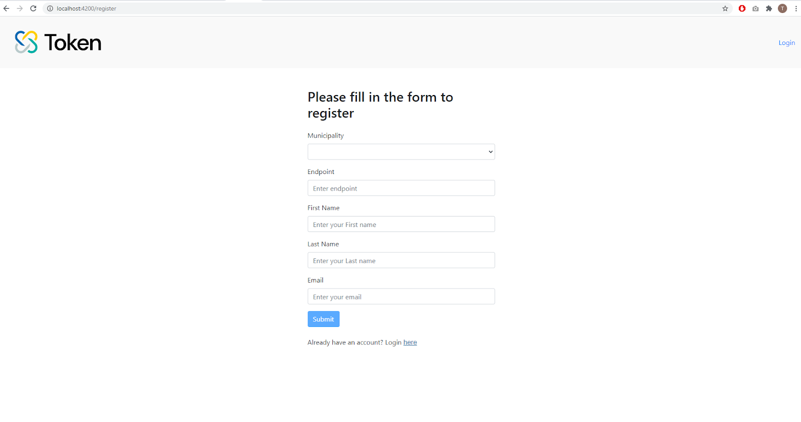
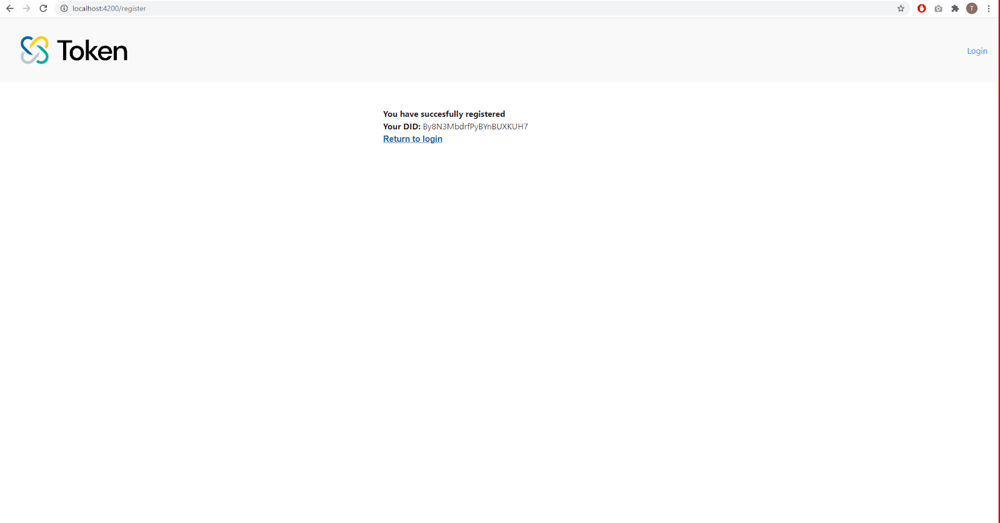
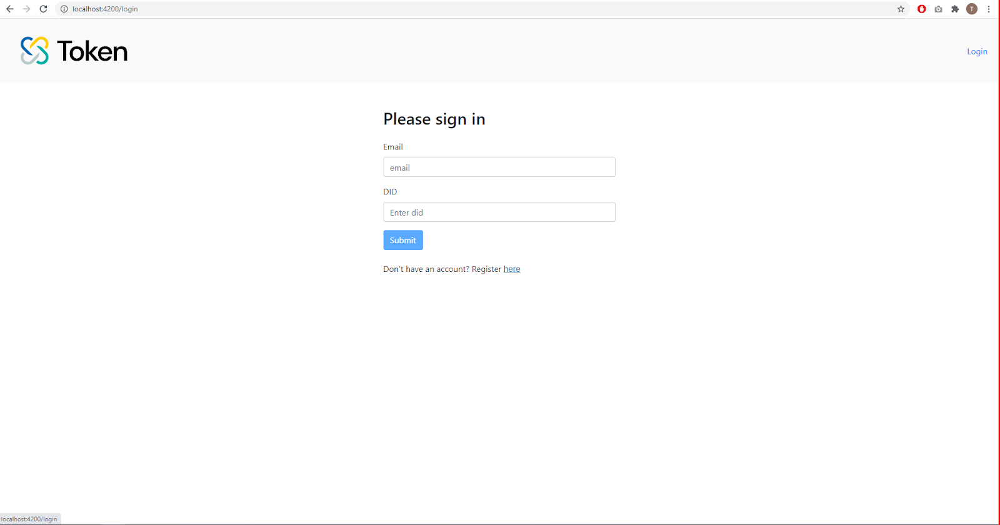

# Fundamentals

## What is SSI

Self-sovereign identity \(SSI\) gives individuals or organizations the ability tocontrol their identity information. SSI acknowledges that identity is about muchmore than logging in. Identity can be expanded to other uses by usingverifiable attestations, called credentials, to prove things about yourself suchas that you are a university diploma owner or that you are eligible toparticipate to an e-voting process. SSI uses verifiable, trustworthy credentialsfor the aforementioned use cases, meaning that the requestor of suchcredentials can cryptographically verify the claimed attestations. Identityowners autonomously use those credentials wherever they want and consentis requested whenever their information is to be accessed. Privacy is a criticalfeature of SSI because, without privacy, there is no control nor security. InSSI, the identity owner stays in control of who sees what. This represents amonumental shift in how identity functions on the internet and combined withblockchain technology an ecosystem of data sovereignty is now possible.

## CERTH SSI

Token's CERTH SSI implementation is a platform in which a user can register, get a DID and request credentials. The user can have their credentials stored in their wallet and access them quickly and easily, without downloading any special software. Thus, CERTH’s SSI is functioning as a service \(SSIaS\). This solution removes the burden of e-government bodies to maintain their own servers, storage or even custom software as all these functionalities are provided out of the box. In this direction, any organization, agency, municipality and governmental service in general can take advantage of the unique characteristics of SSI at no cost and at no time! Following you can find more details how is this achieved and you if you are a public sector service you can apply [https://ssi.token.iti.gr/apply](https://ssi.token.iti.gr/apply) to help you integrate the SSI to any service you require registration/login/verification for user identities. Alternatively, just send us an email at sterzi@iti.gr.

## Architecture



According to the above UML, the user can either register or log in to any platform that utilizes CERTH SSI as a Service solution. Following you can find a detailed guide for the necessary steps. 

**Registration:**



When a user registers, the Endorser Agent creates a DID and makes a connection with the Trustee Agent. When the connection is established, the Endorser Agent sends a proposal to the Trustee Agent in order to issue an ID Verifiable Credential. Then, the Trustee Agent issues an ID credential to the Endorser Agent. Now the user has a DID and an ID Credential in her/his/its wallet. 

When the registration is completed, the user will be directed to a page that shows their DID. The user must keep somewhere safe this DID as a digital or hard copy, because it is their globally unique identifier and it is required in order to log in and communicate with any other service.



**Log in:**



The user, after registers successfully, can log in to the platform with the DID that was created from the registration process. The above transactions of the agents are held in corresponding PostgreSQL databases, one for each agent. They are also stored along with other important metadata information of the user in a MySQL database.

## Endpoints

### Create a local did for the wallet \(User\)

Parameters


Response


### Create a new connection invitation \(Municipality\)

Parameters

Response

### Send a schema to the ledger

Parameters

Response

### Send a credential definition to the ledger

Parameters

Response

### Receive a new connection invitation\(User\)

Parameters

Response

### Send Issuer a credential proposal

Parameters

Response

Did example

```text
{
    "result": {
    "did": "YVJfCH2gPuK3H1qTrZdm8t",
    "verkey": "JAQ5tQnaEoroWesuvmbD4euji6pC6dq8vbw29RTSs45P",
    "posture": "wallet_only" }
}
```

Schema example

```text
{
    "schema_id": "V4SGRU86Z58d6TV7PBUe6f:2:identification:1.0",
    "schema": {
        "ver": "1.0",
        “id”: "V4SGRU86Z58d6TV7PBUe6f:2:identification:1.0",
        “name": "identification”,
        “version": "1.0”,
        “attrNames”: [
        “name”,
        “surname”,
        “fathersname”,
        “mothersname”,
        “motherssurname”,
        “dateofbirth”,
        “placeofbirth”,
        “registeredcitizen”
    ],
    "seqNo": 9
    }
}
```

